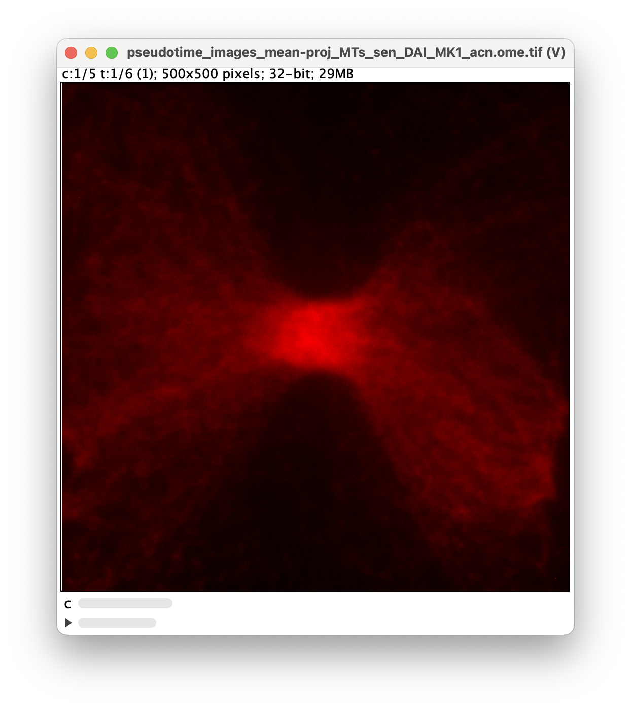

# cytokinesis-pseudotime-analysis

Split 3D expansion microscopy images of cytokinesis into pseudotime windows based on image features. Reconstruct average mean projection, radial projection, and z-stack images using these pseudotime windows.

## Requirements

- Windows 10+, Mac 13.7+ or Linux (Ubuntu 20.04+). 8 GB RAM. *NOTE: Only tested on Windows and Mac.*
- [Miniforge](https://github.com/conda-forge/miniforge?tab=readme-ov-file) or an equivalent `conda` environment manager.

## Setup

Clone this repository. Navigate to the folder containing this repository. Then run, in this folder,

```
conda create -n expansion python=3.11
conda activate expansion
pip install -r requirements.txt
```

To use the Jupyter notebooks, additionally run the following to install the `expansion` kernel.

```
python -m ipykernel install --name expansion --user
```

This process should take less than 5 minutes.

## Usage

### targets.yaml

All notebooks and scripts rely on this file to direct them to data locations. For each protein target of interest, add an entry to this file containing

* The "key", `ALIXm` in this example. This is the most commonly used reference to this target in the raw file names in the `image_directory` (see below).
* `image_directory`: the location of the raw images
* `workbook`: path to an XLSX file containing information about the the images
* `workbook_header_row`: the row in the workbook where the column names are loated
* `workbook_sheet_name`: which sheet contains data about the raw images
* `alias` *(optional)*: if the raw file names refer to this target by more than one name, enter alternatives here. All aliases will be mapped to the "key" in the results for consistent naming of this target.

```
ALIXm:
  image_directory: /path/to/ALIX m
  workbook: /path/to/20250114_ALIXm.xlsx
  workbook_header_row: 0
  workbook_sheet_name: Tabelle1
  alias:
  - ALIX
  - ALIXM
```

### Notebooks

Launch a Jupyter Lab instance in VSCode, another IDE, or through the Miniforge prompt:

```
jupyter lab
```

In Jupyter Lab, open and run the following notebooks in order.

***step1_find_pseudotime_bins.ipynb*** - Compute image metrics and run PCA on the 
resulting feature space. Divide this space into pseudotime bins. Append the results to 
the original workbooks.

***step2_create_pseudotime_image.ipynb*** - Using the results of `step1_find_pseudotime_bins.ipynb`, reconstruct a pseudotime representation
of the midbody, extracted from the original images. The result is an OME-TIFF 
displaying a mean projection, a z-stack, or a radial projection of the midbody over
pseudotime. Color channels represent different target proteins.

***looped_images_over_pseudotime copy.ipynb*** - Provided with pre-calculated pseudotime windows, reconstruct a pseudotime representation
of the midbody, extracted from the original images. The result is an OME-TIFF 
displaying a mean projection, a z-stack, or a radial projection of the midbody over
pseudotime. Color channels represent different target proteins.

### Scripts

Run from a command line (Windows) or Terminal (Mac):

```
conda activate expansion
python looped_images_over_pseudotime.py
```

***looped_images_over_pseudotime.py*** - Performs the same function as `looped_images_over_pseudotime copy.ipynb`, but from a Python script.

## Demo

This demo assumes this software is already downloaded and the `expansion` kernel has been added to Anaconda/Miniforge (see above instructions).

A subset of the data that this package was developed for, is stored as a [Zenodo repository](https://doi.org/10.5281/zenodo.17143815). It contains a limited number of example data for the targets actin and MKLP1. It also contains the workbooks corresponding to the data.

To use the notebooks with the provided data subsets, ***targets.yaml***  has to be updated with the targets, name and location of the notebooks and the directory of the downloaded data:

* Download and unzip the [Zenodo repository](https://doi.org/10.5281/zenodo.17143815).
* In the unzipped folder, unzip `data_subset_example.zip` and `data_subset_example_2.zip`.
* Open ***targets.yaml*** in the unzipped folder and Update `workbook: /path/to/MKLP1_examples.xlsx` to point to the location of `MKLP1_examples.xlsx` in the unzipped folder. For example, having unzipped this folder in a Mac Downloads folder, the path is `workbook: /Users/zach/Downloads/17151188/MKLP1_examples.xlsx`.
* Update `workbook: /path/to/Actin_examples.xlsx` to point to the location of `Actin_examples.xlsx` in the unzipped folder.
* Change `MKLP1`, `image_directory: /path/to/data_subset_example` to point to the location of the unzipped folder coming from `data_subset_example.zip`.
* Change `actin`, `image_directory: /path/to/data_subset_example_2` to point to the location of the unzipped folder coming from `data_subset_example_2.zip`.

Once this is done, in `looped_images_over_pseudotime copy.ipynb` in the code folder, which is where this README file is located, set the following variables in their corresponding locations in the notebook. To be able to do this, first open the notebook in Jupyter Lab. See the above instructions on how to launch Jupyter Lab.

* `targets = file_utils.load_targets('/path/to/unzipped/folder/targets.yaml')`
* `time_key = "Stage"`
* `time_order = ["RC", "CS", "RS", "SM", "BA", "A"]`
* `time_do_not_fit = ["RC", "CS", "A"]`
* `desired_channel_order = ["MTs", "septin", "DAPI", "MKLP1", "actin"]`

where `/path/to/unzipped/folder/` corresponds to the folder where the Zenodo repository was unzipped (e.g. `/Users/zach/Downloads/17151188/` following our earlier example).

Now run the notebook using the `expansion` kernel. First, press "Select Kernel" *alternatively it may say "python3"* in the upper right corner of the Jupyter Notebook to get a dropdown menu that lets you change change the kernel. Then press "Run" (or the play button). The total runtime of the notebook should be approximately 1 minute. 

After the notebook has finished running, there should be a file called `pseudotime_images_mean-proj_MTs_sen_DAI_MK1_acn.ome.tif` in the folder containing the `cytokineses-pseudotime-analysis` code. This file can be opened with [Fiji](https://imagej.net/software/fiji/):



## Related repositories 

The code to generate the table for the merged metrics option, which includes features extracted from Cellprofiler, can be found in the [cytokinesis-feature-analysis](https://github.com/AG-Ewers/cytokinesis-feature-analysis) repository.
